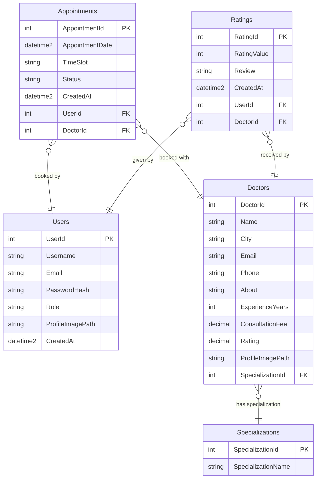

# Entity Relationship Diagram

```mermaid
erDiagram
    Users {
        int UserId PK
        string Username
        string Email
        string PasswordHash
        string Role
        string ProfileImagePath
        datetime2 CreatedAt
    }
    Specializations {
        int SpecializationId PK
        string SpecializationName
    }
    Doctors {
        int DoctorId PK
        string Name
        string City
        string Email
        string Phone
        string About
        int ExperienceYears
        decimal ConsultationFee
        decimal Rating
        string ProfileImagePath
        int SpecializationId FK
    }
    Appointments {
        int AppointmentId PK
        datetime2 AppointmentDate
        string TimeSlot
        string Status
        datetime2 CreatedAt
        int UserId FK
        int DoctorId FK
    }
    Ratings {
        int RatingId PK
        int RatingValue
        string Review
        datetime2 CreatedAt
        int UserId FK
        int DoctorId FK
    }

    Doctors }o--|| Specializations : "has specialization"
    Appointments }o--|| Users : "booked by"
    Appointments }o--|| Doctors : "booked with"
    Ratings }o--|| Users : "given by"
    Ratings }o--|| Doctors : "received by"
```
